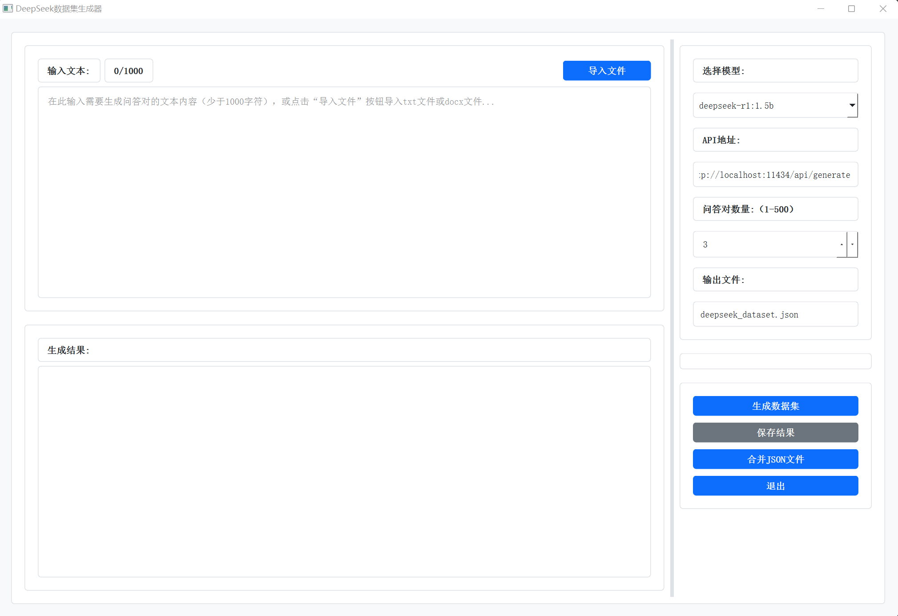

# DeepSeek 数据集生成器

这是一个基于 PyQt6 的图形化界面应用程序，用于生成问答对（问题-回答）数据集。通过输入文本、配置参数，即可自动调用ollama后端 API 生成问答对，并支持保存为 JSON 文件。

# 软件截图


## 系统要求

- Windows 64 位
- macOS 64 位
- Linux 64 位

***Warning: 该程序需预先安装ollama，安装方法请参考相关资料***

## 安装依赖

安装 Python 3.7 或更高版本。

使用以下命令安装所需的 Python 包：

```bash
pip install -r requirements.txt
```

## 运行

在命令行中运行以下命令启动应用程序：

```bash
python dataset_generator.py

```


## 功能描述

- 问答对生成：用户输入文本到文本框，程序会根据文本生成多个相关问题，并自动从后端接口获取每个问题的答案。可以通过左上角的“导入文件”按钮导入 .docx 或 .txt 文件来处理长篇文档。
- 输出格式：生成的问答对以 JSON 格式存储，结构如下：

```json
[
  {
    "conversations": [
      {
        "role": "user",
        "content": "问题内容"
      },
      {
        "role": "assistant",   
        "content": "回答内容"
      }
    ]
  }
]
```

## 界面说明

### 参数设置区域

- 选择模型：有多个预置模型供选择，还可自定义模型名称。
- API地址：设置后端 API 的地址，默认为 http://localhost:11434/api/generate。
- 问答对数量：一次生成的问答对数量，默认为 3，范围是 1-500。
- 输出文件：设置生成结果的输出文件名，默认为 deepseek_dataset.json。

### 控制按钮

- 生成数据集：点击开始根据输入文本和参数生成问答对。
- 保存结果：将生成的问答对保存到指定的 JSON 文件。
- 合并 JSON 文件：可以选择多个 JSON 文件，并将它们合并为一个文件。

### 对话框

- 输入和输出的文本框分别是用户输入原文和生成的问答对结果。

## 使用示例

以下是使用该程序的简单步骤：

1. 输入文本：在左上角的文本框中输入需要生成问答对的文本。
2. 配置参数：配置参数，如选择模型、API 地址、问答对数量等。
3. 生成问答对：点击“生成数据集”按钮，程序会在右侧的文本框中显示生成的问答对。
4. 保存结果：点击“保存结果”按钮，将问答对保存为 JSON 文件。
5. 合并 JSON 文件：可以合并多个 JSON 文件，生成一个完整的数据集。

## 注意事项

- 如果导入的 Word 文档中包含 MathType 公式，程序会尝试将其转化为 LaTeX 格式。
- 输入的文本长度不能超过 1000 字，超过部分会被截断。
- 确保后端 API 地址正确且可访问，否则无法生成问答对。

